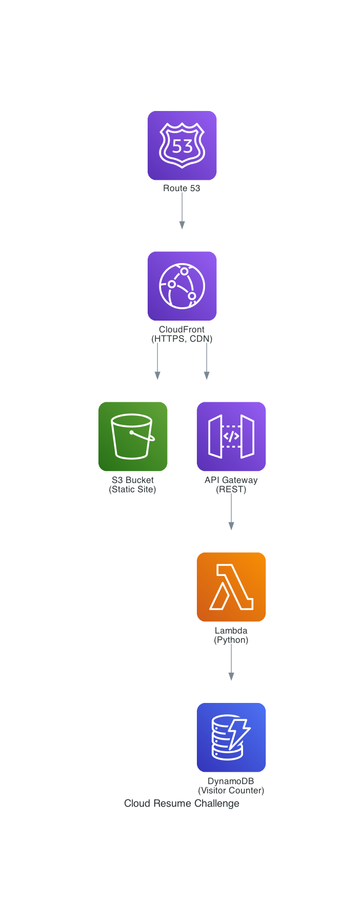

# 01 - Cloud Resume Challenge

Deploy a static resume website to AWS with a serverless visitor counter, demonstrating end-to-end cloud infrastructure skills.

## Architecture




```
                    ┌─────────────┐
                    │  Route 53   │
                    └──────┬──────┘
                           │
                    ┌──────▼──────┐
                    │ CloudFront  │ (HTTPS, CDN)
                    └──────┬──────┘
                           │
              ┌────────────┼────────────┐
              │                         │
       ┌──────▼──────┐          ┌──────▼──────┐
       │   S3 Bucket  │          │ API Gateway │
       │ (static site)│          │   (REST)    │
       └─────────────┘          └──────┬──────┘
                                       │
                                ┌──────▼──────┐
                                │   Lambda    │
                                │  (Python)   │
                                └──────┬──────┘
                                       │
                                ┌──────▼──────┐
                                │  DynamoDB   │
                                │  (counter)  │
                                └─────────────┘
```

## What This Demonstrates

- Static website hosting with S3 + CloudFront
- HTTPS with ACM certificates
- Serverless API (API Gateway + Lambda + DynamoDB)
- Infrastructure as Code (Terraform AND CDK)
- CI/CD with GitHub Actions

---

## Prerequisites

- AWS account with credentials configured (`aws configure`)
- Terraform 1.5+ installed
- Python 3.11+ and AWS CDK installed
- A registered domain (optional — works without one using CloudFront URL)

---

## Deploy with Terraform

```bash
cd terraform

# Initialize Terraform
terraform init

# Preview what will be created
terraform plan

# Deploy
terraform apply

# When done, destroy resources to avoid charges
terraform destroy
```

## Deploy with CDK

```bash
cd cdk

# Create virtual environment
python3 -m venv .venv
source .venv/bin/activate

# Install dependencies
pip install -r requirements.txt

# Bootstrap CDK (first time only)
cdk bootstrap

# Preview changes
cdk diff

# Deploy
cdk deploy

# Destroy when done
cdk destroy
```

---

## Estimated AWS Cost

- **S3:** ~$0.01/month (static files)
- **CloudFront:** Free tier covers 1TB/month
- **Lambda:** Free tier covers 1M requests/month
- **DynamoDB:** Free tier covers 25GB + 25 WCU/RCU
- **ACM:** Free for public certificates

**Total: $0–$1/month within free tier**

---

## Step-by-Step Build Guide

1. Create the static resume site (HTML/CSS/JS)
2. Deploy S3 bucket with website hosting
3. Add CloudFront distribution with HTTPS
4. Build the visitor counter Lambda function
5. Create DynamoDB table for the count
6. Set up API Gateway to expose the Lambda
7. Connect the frontend JS to the API
8. Add GitHub Actions for CI/CD

## Generating the Architecture Diagram

The architecture diagram (`architecture.png`) is generated using Python. To regenerate or modify it:

**Install dependencies:**
```bash
# Graphviz (required for rendering)
brew install graphviz

# Python diagrams library
pip3 install diagrams
```

**Generate the diagram:**
```bash
python3 architecture.py
open architecture.png
```

**Script location:** [`./architecture.py`](./architecture.py)
